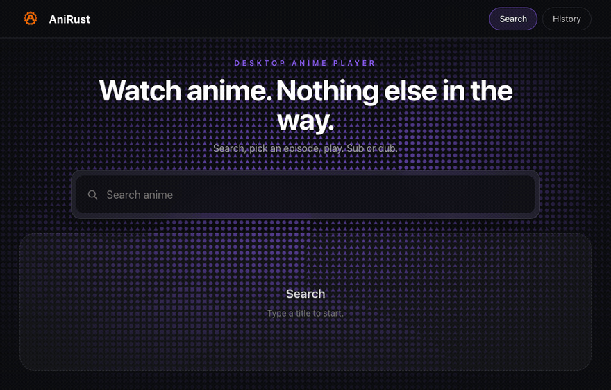
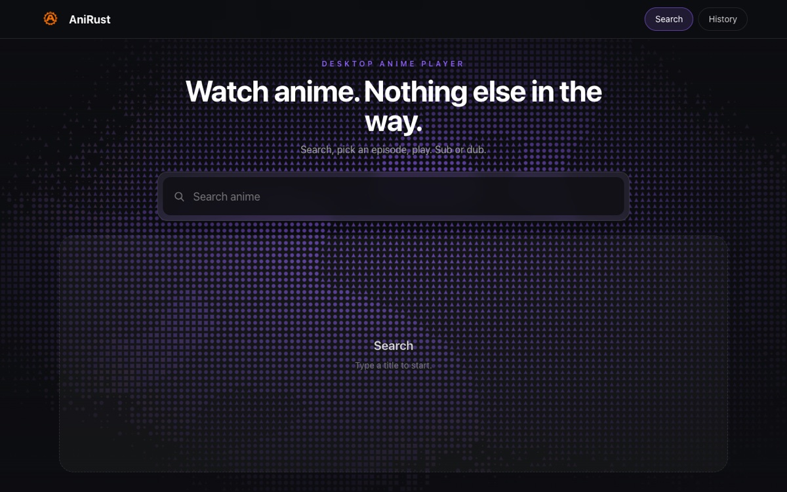
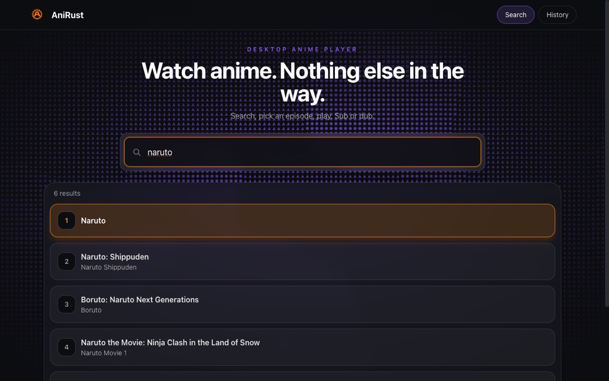
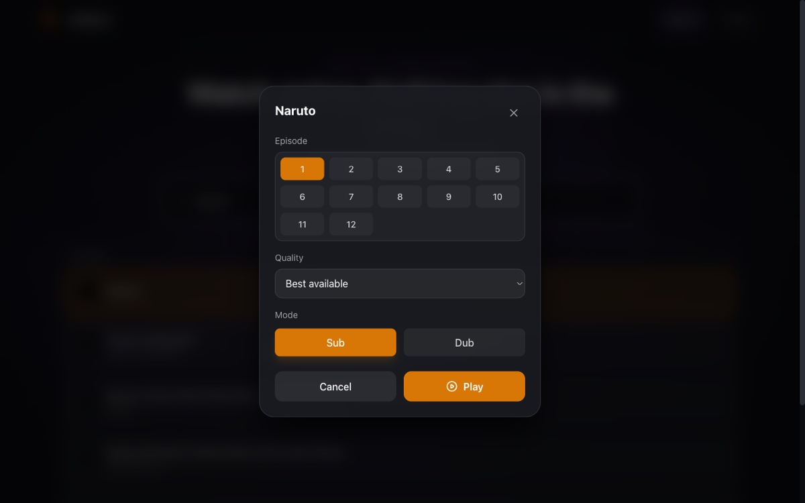
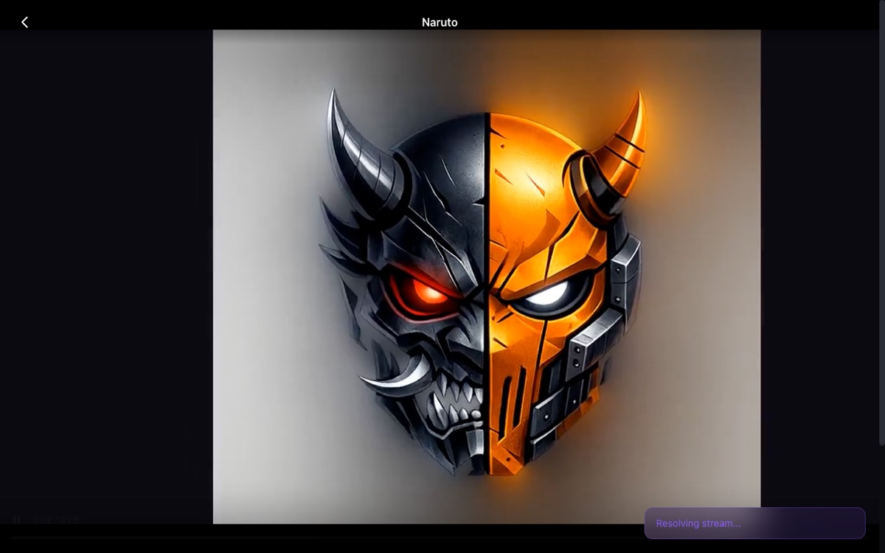
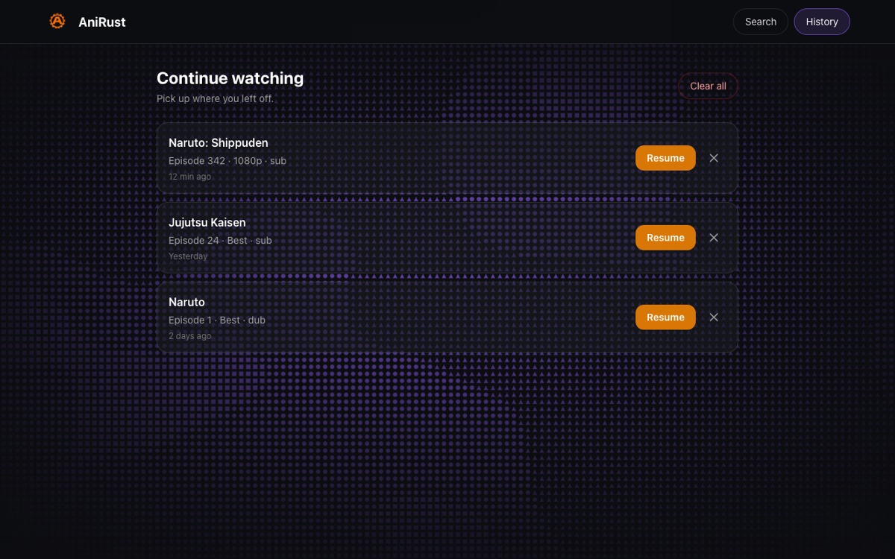

<div align="center">
  
</div>

<h1 align="center">AniRust</h1>

<p align="center">
  A desktop app for watching anime. Search, pick an episode, press play. Sub or dub.
</p>

<p align="center">
  <a href="https://github.com/Isaac-1555/Anickie/releases/latest"><b>⬇ Download the latest release</b></a>
</p>

---

## Download

Grab the installer for your platform from the
[**Releases page**](https://github.com/Isaac-1555/Anickie/releases/latest).

| Platform | File | Notes |
| --- | --- | --- |
| macOS (Apple Silicon) | `AniRust_x.x.x_aarch64.dmg` | M1 / M2 / M3 / M4 |
| macOS (Intel) | `AniRust_x.x.x_x64.dmg` | |
| Windows | `AniRust_x.x.x_x64-setup.exe` or `.msi` | Requires a POSIX shell such as [Git Bash](https://git-scm.com/downloads) on your `PATH` |
| Linux | `AniRust_x.x.x_amd64.AppImage`, `.deb`, or `.x86_64.rpm` | |

### Install

- **macOS** — open the `.dmg` and drag **AniRust** into your Applications folder.
- **Windows** — run the `.exe` or `.msi` installer.
- **Linux (AppImage)** — make it executable and run it:
  ```sh
  chmod +x AniRust_*.AppImage
  ./AniRust_*.AppImage
  ```
- **Linux (.deb / .rpm)** — install with your package manager (`sudo apt install ./AniRust_*.deb` or `sudo dnf install ./AniRust-*.rpm`).

## How to use

1. Open **AniRust**.
2. Type an anime title in the search box and wait a moment for results.
3. Click a result (or highlight it with the arrow keys and press **Enter**).
4. Choose an **episode**, a **quality**, and **Sub** or **Dub**.
5. Press **Play** — the episode opens in the built-in player.
6. Use the **History** tab to jump back into anything you were watching.

## Features

- **Fast search** with debounced queries and keyboard navigation.
- **Sub & Dub** support.
- **Quality selection** from best available down to 360p.
- **Episode picker** — browse the full episode list, or type an episode number directly.
- **Built-in player** with HLS and MP4 playback and subtitle support, so you never leave the app.
- **Continue watching** — a local history tab with one-click resume.
- **No terminal required** — everything happens inside the app window.

## Screenshots

### Home



### Search results



### Episode, quality, and mode picker



### Player



### Continue watching



## Troubleshooting

**macOS says the app is damaged or from an unidentified developer.**
The builds aren't signed with a paid Apple certificate. Right-click the app and choose **Open**, or remove the quarantine flag:

```sh
xattr -dr com.apple.quarantine /Applications/AniRust.app
```

**Windows: playback fails immediately.**
AniRust plays streams through a POSIX shell. Install [Git Bash](https://git-scm.com/downloads) and make sure `sh` is available on your `PATH`.

**A stream fails to load.**
Sources change often. Try a different quality, another episode, or search for the title again.

## Credits

AniRust is a desktop front-end built on top of the open-source
[`ani-cli`](https://github.com/pystardust/ani-cli) project. It does not host any
content — it only plays streams that are publicly available elsewhere.
